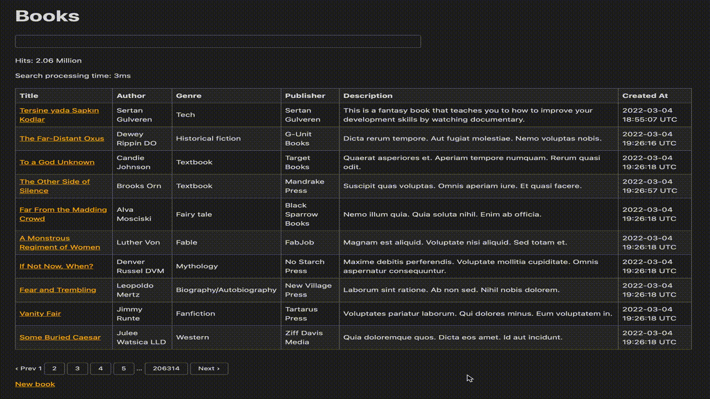

# MeiliSearch Practise Project

The project includes a Book resource that is integrated to MeiliSearch.

It's just a CRUD resource.

You can run the app as follows:

    docker compose up

Then, go here to access the web app: http://localhost:3000

MeiliSearch Dashboard: http://localhost:7700

---
I tried on 2M+ records and here is the my attempts:

